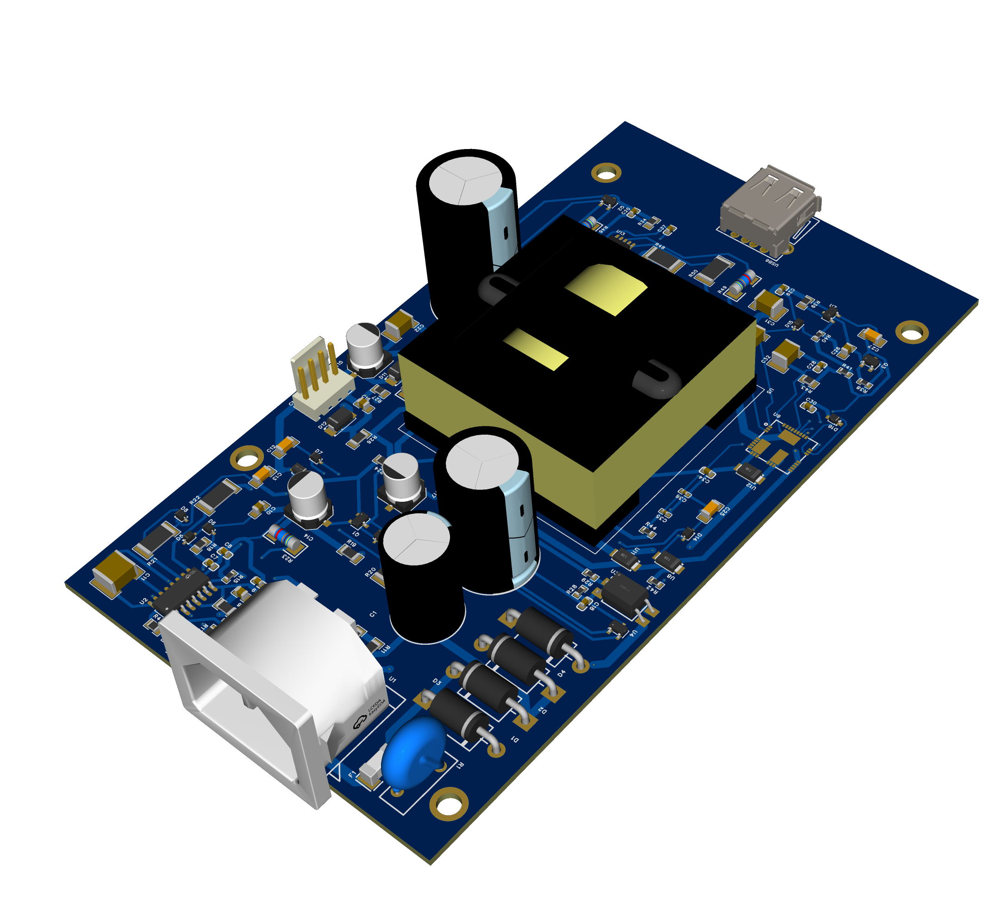
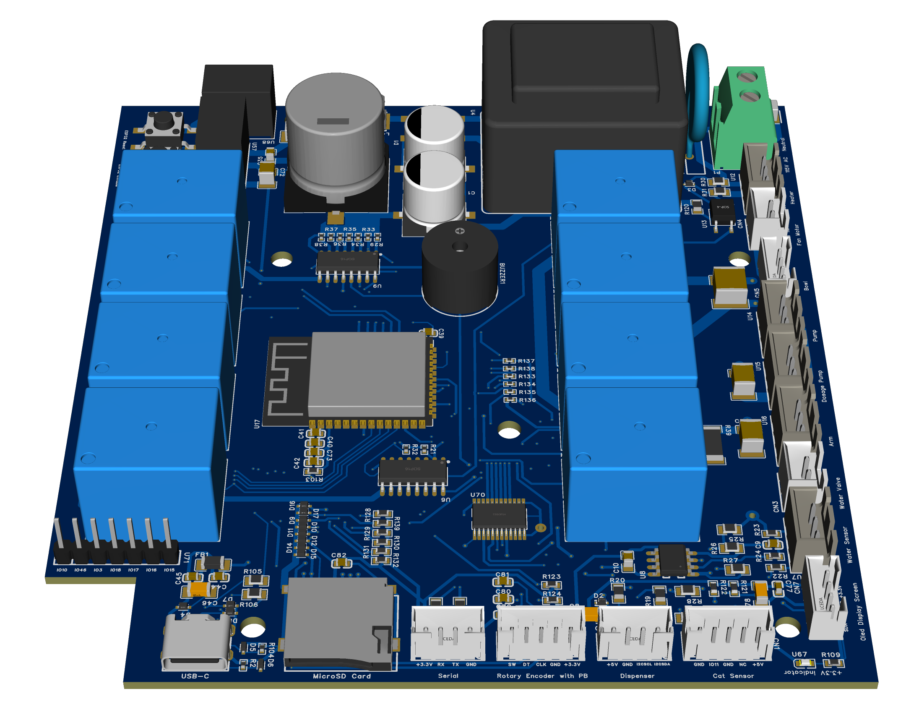

# PCB Design Portfolio

**Electrical & PCB Design Engineer | Embedded Systems Specialist**

---

## About Me

I'm Souhaib Cherbal, an electrical engineer specializing in PCB design and embedded systems. I hold a Master's degree in EMC (Electromagnetic Compatibility) from France and a degree in Electrical Engineering from Algeria. I work primarily with KiCad and EasyEDA, designing everything from simple Arduino-compatible boards to complex multi-layer industrial controllers.

This repository showcases the hardware projects I've worked on, ranging from IoT devices to industrial automation systems.

### What I Focus On
- Custom PCB design and layout
- ESP32 and STM32-based systems
- Power electronics and motor control
- IoT and home automation hardware
- EMC-compliant design
- DFM optimization for manufacturing

---

## Technical Capabilities

**PCB Design Tools:** KiCad, EasyEDA, Altium Designer

**Microcontrollers:** ESP32, STM32, Arduino-compatible platforms

**Design Experience:**
- Multi-layer PCB layouts (up to 8 layers)
- High-speed digital and analog circuits
- Power management systems
- RF/wireless circuit design
- Sensor integration for embedded applications

---

## Featured Projects

### IoT & Communication

**ESP32 MCU with USB-C Serial Interface**

A compact ESP32 development board featuring USB-C connectivity. Designed for modern IoT applications with WiFi/Bluetooth support and an integrated programming interface.

**ESP32-Based 12-Relay Module for Home Automation**

12-channel relay board for smart home control. Includes isolated inputs, WiFi connectivity, and support for remote monitoring. Used in residential and light industrial automation.

**ESP32 Custom Development Board**

A custom ESP32 breakout with optimized antenna placement and expanded I/O. Built for prototyping and small-batch production.

### Industrial Control

**PLC Based on ESP32**

An ESP32-powered programmable logic controller with industrial I/O interfaces. Designed for real-time control applications with networking capabilities.

**STM32F401 PCB Design**

Development board built around the STM32F401 (ARM Cortex-M4). Optimized power distribution and multiple communication interfaces for embedded applications.

**STM32 BlackPill-Based Design**

Compact STM32F4xx-based board for high-performance processing in a small form factor.

### Power & Control

**AC Current Direction and RMS Measurement System**

Bidirectional AC current sensing system with isolated measurement and real-time RMS calculation. Built with the Arduino Pro Micro.

**Controller Board with OpAmps**

Multi-channel precision analog signal conditioning board. Low-noise design with modular architecture for scaling.

**Servo Motors PCB**

Multi-channel servo motor controller with PWM signal generation and feedback control.

**LED Strip Controller**

RGB LED strip controller with PWM dimming and multi-channel support.

### Development & Prototyping

**Enhanced Arduino-Compatible Starter Board**

Extended Arduino-compatible board with onboard sensors and indicators. Designed for educational use and rapid prototyping.

### 3D Design Examples

| Design | Notes |
|--------|-------|
|  | Component placement optimization with 3D rendering |
|  | Multi-layer design with mechanical constraints |

---

## My Design Workflow

**Requirements → Schematic → Layout → Validation → Manufacturing**

I start by understanding what you need, then move through circuit design, PCB layout with proper stackup planning, and thorough verification before generating production files. I work closely with manufacturers to ensure smooth fabrication and assembly.

---

## Services

I'm available for PCB design projects including:
- Custom board design from concept to production
- Schematic capture and component selection
- Multi-layer layouts with signal integrity optimization
- EMC compliance consulting
- Design reviews and optimization
- Prototype development and testing support

---

## Get in Touch

**Email:** SouhaibCherbal@gmail.com

**LinkedIn:** [linkedin.com/in/souhaib-cherbal](https://linkedin.com/in/souhaib-cherbal)

**GitHub:** [github.com/Souhaib-Cherbal](https://github.com/Souhaib-Cherbal)

Feel free to reach out if you're working on a hardware project and need design support.

---

## License

This repository is a portfolio showcase. Individual projects may have different licenses. Contact me regarding commercial use.

---

⭐ **If you find this work useful, consider starring the repository!**

*Last updated: September 2025*
